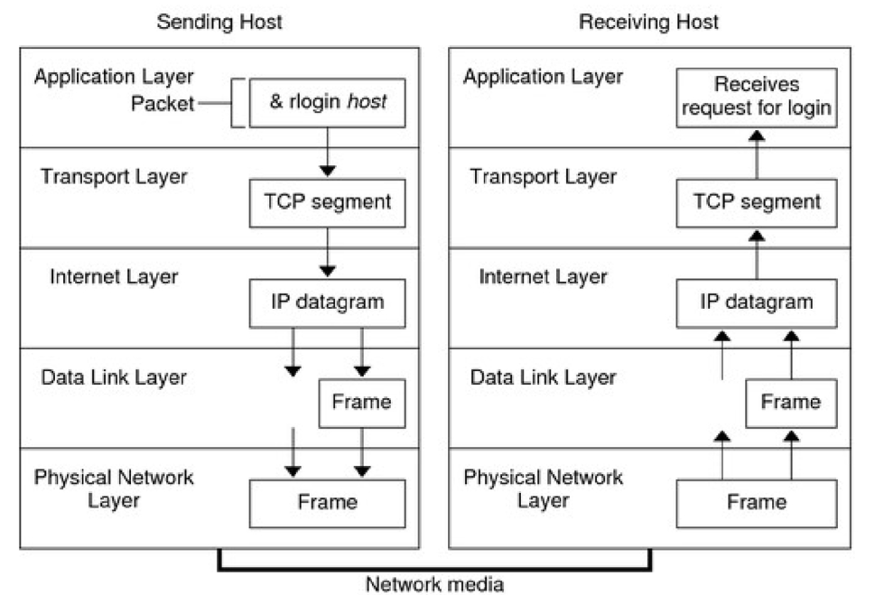

# 230530

# 네트워크

- 네트워크 개요
    - 네트워크 구성 요소
- 네트워크 모델
    - OSI 계층 모델
    - TCP/IP 모델
- 네트워크 프로토콜
    - 주요 프로토콜 소개
    - IPv4 vs IPv6, CIDR

## 네트워크 개요

client -> request -> server server -> response -> client

- LAN(Local Area Network)
    - 가정, 사무실 또는 건물과 같은 제한된 지리적 영역 내의 장치를 연결하여 리소스를 공유하고 서로 통신할 수 있는 네트워크 인프라
- WAN(Wide Area Network)
    - 지리적으로 넓은 영역을 통과하는 네트워크를 의미, 여러 개의 LAN을 연결
    - 인터넷은 전세계의 네트워크와 장치를 연결하는 WAN이라 볼수 있음
- 네트워크란?
    - 두개 이상의 컴퓨터 및 장치들이 연결되어 데이터를 주고 받을 수 있는 시스템 또는 구조
- 네트워크 구성형태 (Network Topologies)
    - Star, Mesh, Bus, Ring, Tree, Line 등 형태가 존재
    - 효율성을 위해 이를 조합한 Hybrid 형태의 네트워크를 구성

## 네트워크 모델

1. OSI 7계층 모델
    - L7 응용 계층 (Application Layer)
    - L6 표현 계층 (Presentation Layer)
    - L5 세션 계층 (Session Layer)
    - L4 전송 계층 (Transport Layer)
    - L3 네트워크 계층 (Network Layer)
    - L2 데이터 링크 계층 (Data Link Layer)
    - L1 물리 계층 (Physical Layer)
2. TCP/IP 모델

| TCP/IP 모델 | TCP/IP 프로토콜 집합 |
| --- | --- |
| 응용 계층 (Application Layer) | HTTP, FTP, SMTP, DNS, TELNET |
| 전송 계층 (Transport Layer) | TCP, UDP, SCTP |
| 인터넷 계층 (Internet Layer) | IPv4, IPv6, ARP ICMP |
| 링크 계층 (Link Layer) | PPP(Point to Point Protocol)
Ethernet (IEEE 802.3)
Wi-Fi(IEEE 802.11) |

### 응용 계층 (Application Layer)

- 응용 프로그램을 위한 정보(메시지 교환 규칙 정의) - HTTP (Hypertext Transfer Protocol) : 웹 상에서 하이퍼텍스트 문서를 전송하기 위한 프로토콜 클라이언트와 웹 서버 간의 통신에 사용
- FTP (File Transfer Protocol) : 파일 전송을 위한 프로토콜
- SMTP (Simple Mail Transfer Protocol) : 전자 메일의 송신을 위한 프로토콜, 메일 서버 간의 이메일 전송을 담당

### 전송계층 (Transport Layer)

- 응용프로그램을 위한 end-to-end 통신 서비스를 제공 - 주요 프로토콜 : TCP(Transmission Control Protocol), UDP(User Datagram Protocol)
- TCP : 신뢰성 있는, 연결 지향적인 통신 및 데이터 전송, 패킷 재정렬 및 흐름 제어를 제공. 패킷 손실이 없으므로 파일전송(FTP), 웹서비스(HTTP) 등에 사용
- UDP : 패킷에 대한 확인 응답을 제공하지 않음. 신뢰성이 TCP에 비해 낮은 반면, 오버헤드가 적어 비디오 및 음성 스트리밍에 적합

### 인터넷 계층 (Internet Layer)

- IP (Internet Protocol) 프로토콜을 기반으로 사용
- 데이터의 라우팅과 패킷 전송을 담당 : 데이터를 패킷으로 분할하고, 목적지로의 경로를 결정하며, 패킷을 목적지까지 전송
- ICMP(Internet Control Message Protocol) : 오류 보고, 혼잡 보고, 통과 같은 다양한 네트워크 관련 기능에 사용

### 링크 계층 (Link Layer)

- 네트워크와 직접 연결되는 하드웨어적인 인터페이스를 제공
- PPP(Point to Point Protocol) : 두 라우터간의 직접적인 연결을 위해 일반적으로 사용
- Ethernet(IEEE 802.3) : 유선 네트워크 프로토콜, LAN의 장치 간 데이터 전송 방식을 정의
- Wi-Fi(IEEE 802.11) : 무선 네트워크 프로토콜

### TCP/IP 프로토콜 데이터 통신

- 사용자의 명령이나 메시지는 로컬 시스템의 TCP/IP 프로토콜 스택을 통과
- 송신 호스트의 각 계층에 있는 프로토콜은 원본 데이터에 정보 추가
- 캡슐화(Encapsulation) - (TCP protocol)
    - 응용 계층 : 데이터를 스트림 형태로 송신
    - 전송 계층 : 응용 계층에서 받은 데이터를 세그먼트로 나누고 각 세그먼트에 헤더를 붙임
    - 인터넷 계층 : 세그먼트 패킷(IP 데이터그램) 단위로 만들고, 헤더에 송신 호스트의 IP 주소, 데이터 길이, 시퀀스 순서 등을 포함
    - 링크 계층 : IP 데이터그램을 프레임으로 포맷, 전송이 정상적으로 이루어졌는지 확인하는 CRC(Cyclic Redundancy Check) 필드를 포함, 프레임 전송

## 네트워크 프로토콜

HTTP (Hypertext Transfer Protocol)

- HTML과 같은 하이퍼미디어 문서를 전송하기 위한 응용계층 프로토콜
- 클라이언트-서버 모델을 따름
- 상태 비보존형(stateless) 프로토콜
    - 각각의 요청은 이전 요청과 독립적으로 처리
    - 모든 요청은 개별적으로 처리하고 응답을 반환한 후 클라이언트와의 연결을 끊음
    - 서버는 클라이언트의 이전 요청이나 상태를 알지 못하며
    - 클라이언트도 서버와의 상태를 유지하지 않음
    - 클라이언트와 서버 간 상태를 공유해야 한다면 쿠키, 세션 등을 사용

HTTP 메시지

- 서버와 클라이언트 간에 데이터가 교환되는 방식
- Request와 Response

전송계층 (Transport Layer)

- 응용 프로그램을 위한 end-to-end 통신 서비스를 제공
- 주요 프로토콜 : TCP(Transmission Control Protocol), UDP(User Datagram Protocol)

TCP

3-way handshake

- TCP는 연결 지향적인 프로토콜, 연결이 확립된 후 데이터 전송이 가능
- 연결을 확립하는 과정을 3-way handshake라 한다.
    1. 클라이언트는 서버에 연결 요청(SYN)
    2. 서버 응답 및 연결 수락 (SYN - ACK)
    3. 클라이언트 응답 및 연결완료 (ACK)

인터넷 계층 프로토콜

IP Address

- 인터넷규약주소는 네트워크에서 장치(HOST)를 식별하기 위해 사용하는 번호

IPv4

- 주소가 32비트로 구성, 일반적으로 사용하는 IP주소
- 네트워크 ID, 호스트 ID로 구성

서브넷 마스크(Subnet Mask)

|  | Binary form | Dot-decimal notation |
| --- | --- | --- |
| IP address | 110000000.00000000.00000010.10000010 | 192.0.2.130 |
| Subnet mask | 11111111.11111111.11111111.00000000 | 255.255.255.0 |
| Network prefix | 11000000.00000000.00000010.00000000 | 192.0.2.0 |
| Host identifier | 00000000.00000000.00000000.10000010 | 0.0.0.130 |

IPv6

- 주소가 128비트로 구성, IP부족 해결, 보안기능 추가, 패킷 크기 확장 등
- 아직 많이 사용되지 않고 있음